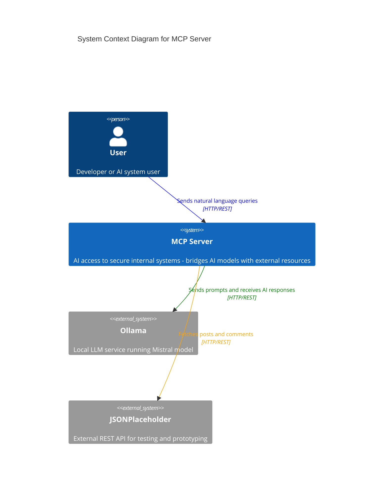

# MCP Server

**MCP (Model Context Protocol) Server** is an educational implementation that demonstrates how AI agents can securely interact with external systems. This project showcases the MCP pattern - a standardized way for AI models to access databases, APIs, and other resources through controlled interfaces.

## Problem Statement

This project demonstrates a **Proof of Concept (PoC)** for enabling AI models (LLMs) to access any APIs and systems through a controlled interface. The challenge is creating a standardized bridge between AI agents and external resources, with the architecture designed to support future security and authorization mechanisms.

## Educational Purpose

This implementation serves as a learning example for:
- **MCP Protocol Concepts** - Understanding how AI agents communicate with external tools
- **Clean Architecture** - Demonstrating separation of concerns and modular design
- **AI Agent Patterns** - Showing how LLMs can orchestrate tool usage
- **Modern Python Practices** - FastAPI, dependency injection, and containerization

The project uses JSONPlaceholder API as a simple external resource and Ollama's Mistral model for AI processing, making it easy to understand and experiment with MCP concepts.

## Architecture Overview

The MCP Server follows clean architecture principles with clear separation of concerns:

### System Context


For detailed architecture diagrams (Container and Component levels), see [C4 Architecture Documentation](docs/c4-architecture.md).

## Key Features
- **Modular adapter/plugin architecture** for easy extension
- **Environment-based configuration management** (.env files)
- **Dependency injection** for better testability
- **LLM agent integration** with Ollama (mistral model)
- **Clean architecture** with separation of concerns
- **Docker support** with separate configs for development and production
- **FastAPI** with automatic API documentation

## Project Structure
```
docker-compose.yml        # Docker Compose configuration with Ollama service
Dockerfile                # Dockerfile for building the app image
requirements.txt          # Python dependencies
.env.local               # Local development configuration
.env.docker              # Docker/production configuration
app/
    config.py             # Configuration management with environment support
    llm_agent.py          # LLM agent integration
    logger.py             # Logging setup
    main.py               # FastAPI application entry point
    router.py             # API routing with dependency injection
    adapters/             # Adapter plugins for external resources
        jsonplaceholder_comments.py
        jsonplaceholder_post.py
    prompts/              # System prompts for LLM agents
        system_prompt.txt
docker/
    ollama-entrypoint.sh  # Automated Ollama setup script
docs/
    c4-architecture.md    # Detailed C4 architecture diagrams
```

## Quick Start

### Local Development
```bash
# Install dependencies
pip install -r requirements.txt

# Install Ollama (if not already installed)
# Download from: https://ollama.ai/download

# Setup Ollama with mistral model
ollama pull mistral
ollama run mistral

# Run the application
uvicorn app.main:app --host 0.0.0.0 --port 8080 --reload --env-file .env.local
```

### Docker Deployment
```bash
# Start all services (includes Ollama with automatic mistral download)
docker-compose up --build

# This will:
    - Start Ollama service and automatically download mistral model
    - Build and start the MCP Server application
    - Set up internal Docker networking between services
```

## API Usage

### Interactive Documentation
- **Local**: http://127.0.0.1:8080/docs
- **Docker**: http://localhost:8080/docs

### Example Requests

**Ask the AI agent to fetch data:**
```bash
# Get a post using natural language
curl -X POST http://localhost:8080/ask \
  -H "Content-Type: application/json" \
  -d '{"query":"Get me post number two"}'

# Get comments for that post
curl -X POST http://localhost:8080/ask \
  -H "Content-Type: application/json" \
  -d '{"query":"Now show me all comments for that post"}'
```

**Direct tool calls:**
```bash
# Fetch post directly
curl -X POST http://localhost:8080/post-call \
  -H "Content-Type: application/json" \
  -d '{"post_id": 2}'

# Fetch comments directly
curl -X POST http://localhost:8080/comments-call \
  -H "Content-Type: application/json" \
  -d '{"post_id": 2}'
```

## Configuration

The application uses environment-based configuration:

- **`.env.local`** - Local development (localhost URLs)
- **`.env.docker`** - Docker environment (container service names)

Key configuration options:
- `llm_base_url` - Ollama API endpoint
- `local_api_base` - This application's base URL
- `jsonplaceholder_base_url` - External API endpoint

## Architecture Patterns

- **Dependency Injection** - FastAPI's `Depends()` system for settings and logging
- **Adapter Pattern** - External API integrations with consistent interfaces
- **Agent Pattern** - LLM orchestration and tool dispatching
- **Clean Architecture** - Separation of concerns across layers
- **Environment-based Configuration** - Different configs for different environments

## Docker Storage

The application uses Docker volumes for persistent data:
- `ollama_data` - Stores the mistral model (~4GB) and Ollama configuration
- Models persist between container restarts for faster startup times

## Troubleshooting

**Common Issues:**

1. **"Name or service not known" in Docker**
   - Use `docker-compose up` to start all services together
   - Ensure .env.docker uses correct service names

2. **Ollama connection refused**
   - **Local**: Ensure `ollama run mistral` is running
   - **Docker**: Wait for mistral model download (check logs)

3. **Model not found errors**
   - **Local**: Run `ollama pull mistral`
   - **Docker**: Restart services if download failed

## License

This project is licensed under the MIT License. See the [LICENSE](LICENSE) file for details.

## Development

This project was developed with the assistance of:
- **ChatGPT o4-mini-high** - AI assistance for code architecture and implementation
- **GitHub Copilot Agent (Claude Sonnet 4)** - AI-powered code completion and refactoring

## Author
Pavel Shyrko