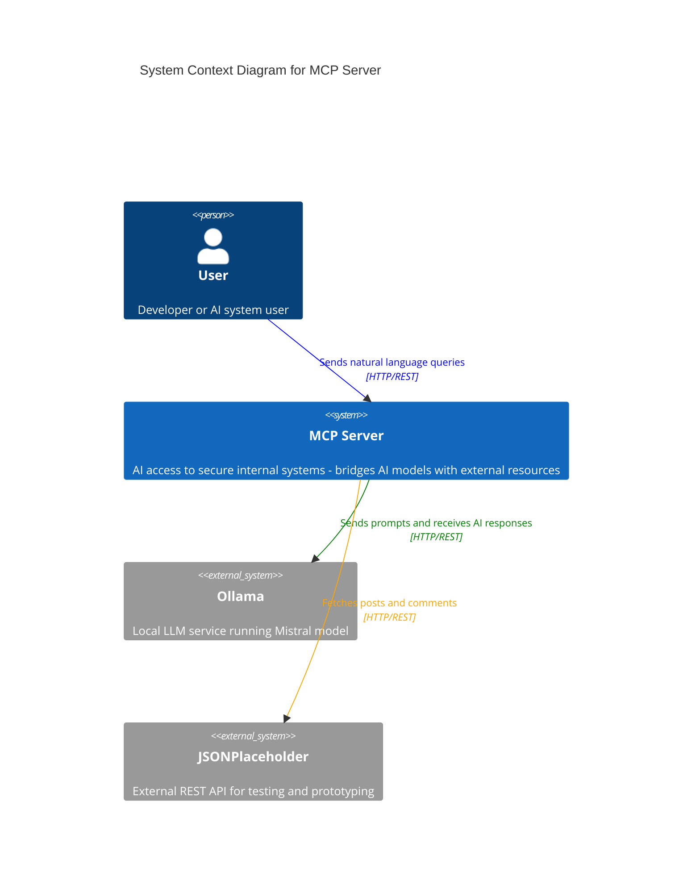
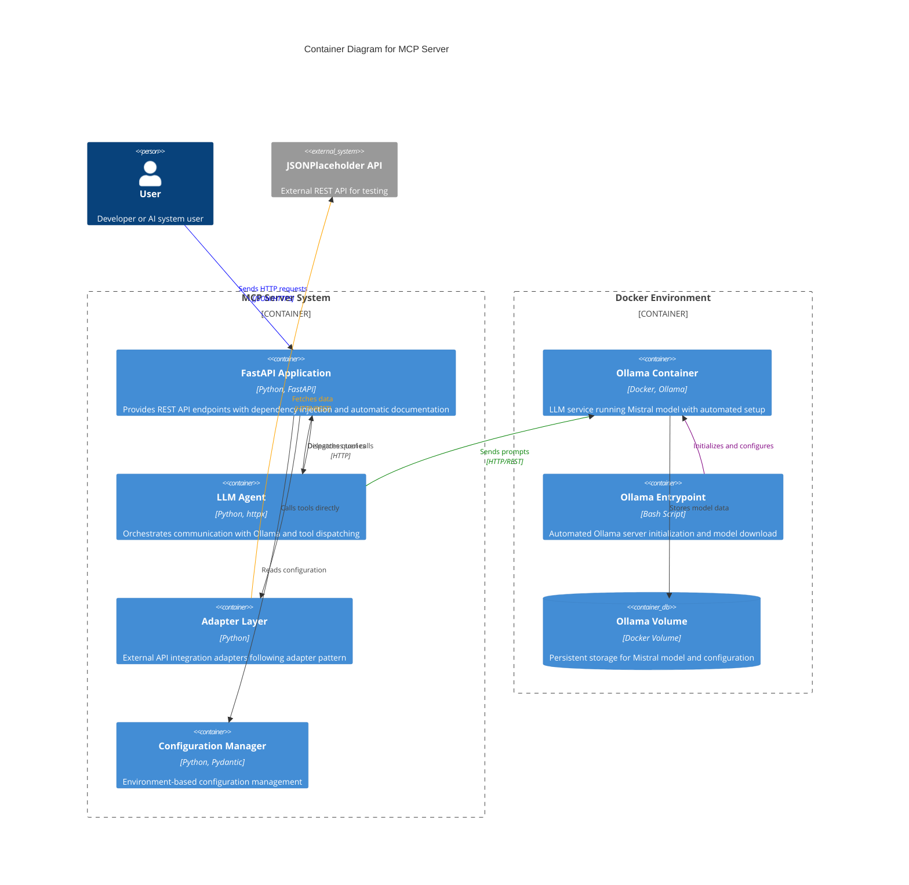
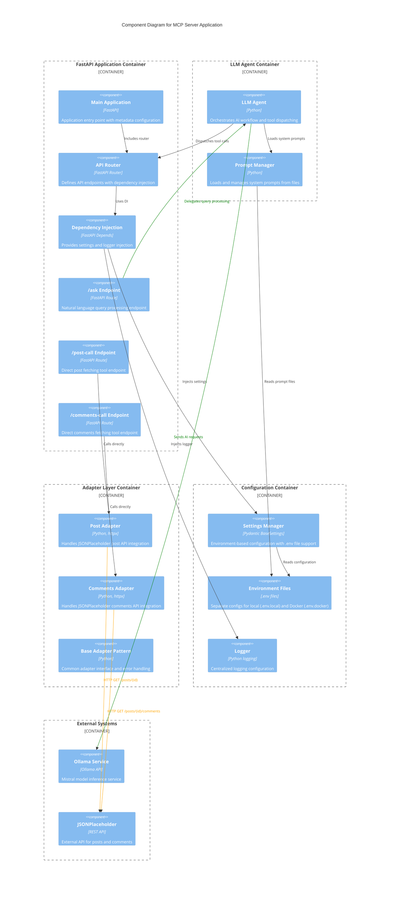

# MCP Server - C4 Architecture Diagrams

## Level 1: System Context Diagram

## Level 2: Container Diagram

## Level 3: Component Diagram

## Architecture Patterns Used

### 1. **Dependency Injection Pattern**
- FastAPI's `Depends()` for settings and logger injection
- Improves testability and flexibility
- Allows easy mocking in tests

### 2. **Adapter Pattern**
- Separate adapters for each external API integration
- `jsonplaceholder_post.py` and `jsonplaceholder_comments.py`
- Consistent interface for external resource access

### 3. **Configuration Management Pattern**
- Environment-based configuration with Pydantic
- Separate `.env.local` and `.env.docker` files
- Type-safe configuration with validation

### 4. **Agent Pattern**
- LLM Agent orchestrates the AI workflow
- Dispatches to appropriate tools based on AI response
- Maintains conversation context

### 5. **Clean Architecture Principles**
- Separation of concerns across layers
- External dependencies isolated in adapters
- Configuration and logging centralized
- Business logic separated from infrastructure

## Data Flow

1. **User Request** → FastAPI Router
2. **Router** → Dependency Injection (Settings, Logger)
3. **Router** → LLM Agent (for `/ask` endpoint)
4. **LLM Agent** → Ollama (AI processing)
5. **LLM Agent** → Tool Dispatcher → Specific Adapter
6. **Adapter** → External API (JSONPlaceholder)
7. **Response** ← Back through the chain to User
